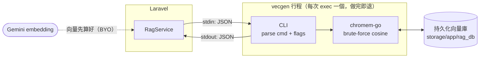
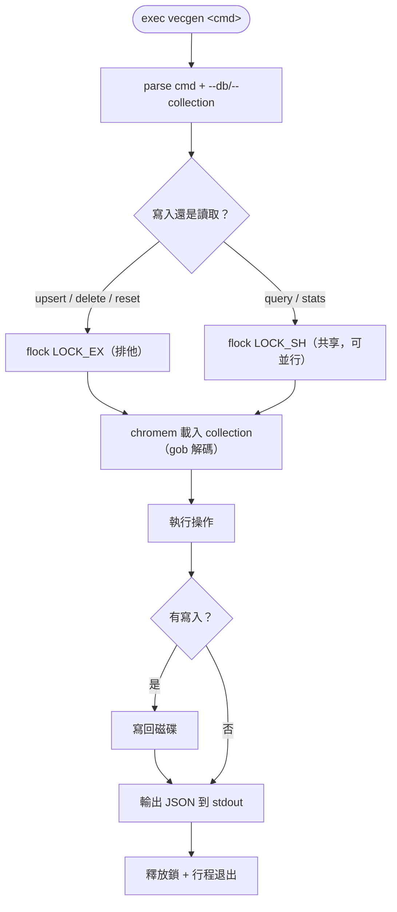

# vecgen — RAG 向量庫 CLI（chromem-go）

純 Go、**非常駐**的向量庫 CLI，是 RAG 系統的「向量引擎」。Laravel（`RagService`）每次操作
就 `exec` 一次：JSON 走 stdin、JSON 回 stdout，做完即退、零常駐（同 memctl/taskctl/agydctl 慣例）。

> **BYO embeddings**：向量一律由呼叫端（Laravel + Gemini）算好提供，vecgen 只負責**存與查**，
> 自己不打任何 embedding API。底層用 [`chromem-go`](https://github.com/philippgille/chromem-go)
> （brute-force cosine、持久化、CGO-free）。



> 向量由 Laravel 端算好隨 `upsert`/`query` 帶入；vecgen 不打任何 embedding API。

---

## 編譯

binary 為 **gitignore**（同 ws-lab/memctl 慣例），clone 後需自行編譯：

```bash
cd cmd/vecgen && go build -o vecgen .
```

直接執行（不帶參數）即印 usage：

```bash
cmd/vecgen/vecgen
```

> 需 Go 1.24+（chromem-go 純 Go、免裝額外擴充）。

---

## 子命令

所有命令共用旗標：`--db <dir>`（持久化目錄，或環境變數 `VECGEN_DB`）、`--collection <name>`（預設 `kb`）。
輸入由 stdin 餵 JSON、輸出為一行 JSON。

| 命令 | stdin | 作用 | 輸出 |
|------|-------|------|------|
| `upsert` | `{"documents":[{id,content,embedding,metadata}]}` | 批次新增/覆蓋（同 id 覆蓋） | `{ok,count,total}` |
| `query` | `{"embedding":[...],"top_k":5,"where":{...},"where_document":{...}}` | 餘弦相似度檢索 | `{results:[{id,content,similarity,metadata}]}` |
| `stats` | （無） | collection 塊數 + 全部 collection 列表 | `{collection,count,collections}` |
| `delete` | `{"ids":[...]}` 或 `{"where":{...}}` 或 `{"where_document":{...}}` | 按 id／metadata／內容刪除 | `{ok,total}` |
| `reset` | （無） | 刪整個 collection | `{ok}` |

過濾語義：
- `where`：metadata **精確比對**（如 `{"file_id":"abc"}`，AND-only）。
- `where_document`：內容過濾，`{"$contains":"..."}` / `{"$not_contains":"..."}`（子字串）。

> collection 命名由 Laravel 端組成 `<庫名>__<模型>__<維度>`，vecgen 本身 model-agnostic、不關心語義。

### 範例（端到端：存一筆、查一筆）

```bash
DB=storage/app/rag_db
echo '{"documents":[{"id":"a","content":"hi","embedding":[1,0,0]}]}' | cmd/vecgen/vecgen upsert --db $DB
echo '{"embedding":[1,0,0],"top_k":1}' | cmd/vecgen/vecgen query --db $DB
```

---

## 並行：flock 讀寫鎖

chromem-go 用 `os.Create` 就地覆寫檔案（非原子）、且無內建並行保護，故 vecgen 自加 flock：

- **寫入**（upsert/delete/reset）取**排他鎖** `LOCK_EX`
- **讀取**（query/stats）取**共享鎖** `LOCK_SH` —— 避免在寫入途中讀到半殘檔導致 gob 解碼崩潰

多個讀取可並行；寫入與所有讀寫互斥。鎖檔為 `<db>.lock`。



---

## 環境變數

| 變數 | 說明 | 預設 |
|------|------|------|
| `VECGEN_DB` | 持久化 DB 目錄 | `./rag_db`（Laravel 端預設 `storage/app/rag_db`） |

Laravel 端對應 `config/rag.php` 的 `vecgen.bin` / `vecgen.db`（env `VECGEN_BIN` / `VECGEN_DB`）。

---

## 錯誤處理

任何錯誤輸出 `{"error":"..."}` 並以 exit code 1 結束；`RagService` 會解析此 JSON 拋
`AIServiceException`。
