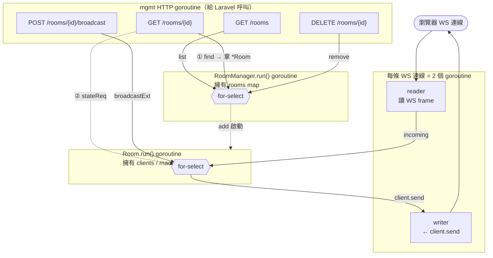
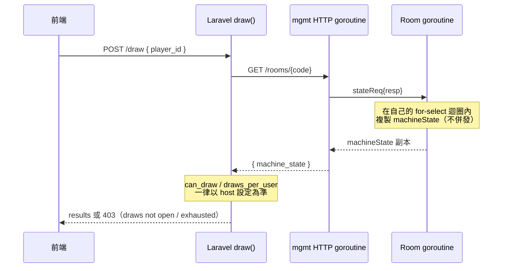

# ws-lab — Go WebSocket Server

多房間 WebSocket server，同時服務 `ws-lab`（即時串流 demo）與 `gacha`（多人抽卡房）兩種房型。
對外有兩個 listener：

- **WS listener**：瀏覽器連線（`/ws-lab`、`/ws-lab/{room}`）
- **mgmt HTTP listener**（預設 `127.0.0.1:9002`）：給 Laravel 後端呼叫的內部管理 API

---

## 併發模型：goroutine 各擁狀態，channel 序列化存取

核心原則是 Go 的慣用法 —— **「不要共享記憶體來溝通，要用溝通來共享記憶體」**。
每塊可變狀態只屬於**一個** goroutine，其他人想讀寫一律丟 request 進 channel、等回應，
存取因此天生序列化，不需要 mutex，也不會 data race。

| goroutine | 擁有的狀態 | 對外的 channel |
|-----------|-----------|----------------|
| `RoomManager.run()` | `rooms` map（所有房間） | `find` / `add` / `remove` / `list` / `broadcastAll` |
| `Room.run()`（每房一個，dispatch 到 `runGacha`/`runGlobal`） | `clients`、`connsByIP`、`machineState`、`host` | `join` / `leave` / `incoming` / `broadcastExt` / `authDone` / `stateReq` / `shutdown` |
| client reader（每連線一個） | WS 讀取 | → 房間的 `incoming` |
| client writer（每連線一個） | WS 寫出 | ← `client.send` |
| mgmt HTTP handler | 無自有狀態 | 只透過上述 channel 與 manager/room 溝通 |

> ⚠️ 關鍵：`machineState`、`clients` 這些 room-local 狀態，**只有該 room 的 goroutine 會碰**。
> HTTP handler、其他 goroutine 想讀，一律走 channel（如 `MachineState()` 送 `stateReq`），
> 不直接讀那塊記憶體 —— 否則對 map 併發讀寫會讓整個 process panic。

### 整體流向



---

## machine_state 的讀寫（gacha 房）

`machineState` 是 host（房主）透過 WS 設定的機台狀態（`can_draw`、`draws_per_user`、
`is_ten_pull`、`skip_anim`），是抽卡限制的**唯一真相來源**。

**寫入**：只接受 host 的 `machine_state` 訊息（[`handleGacha`](main.go) 內 `if !c.isHost { return }`），
在 room goroutine 內寫 `r.machineState`。

**讀取**：
1. 新玩家 join 時，room goroutine 把目前狀態推給他（同一 goroutine，安全）。
2. Laravel 抽卡時，後端打 `GET /rooms/{code}` 查狀態 —— HTTP handler 呼叫
   `room.MachineState()`，**送 `stateReq` 進 room 的 select 迴圈**，由 room goroutine
   複製一份 map 回傳，再吐 JSON 給 Laravel。

### 抽卡時的狀態查詢（防作弊）

後端不信任 client 傳來的 `can_draw` / `draws_per_user`，改向 ws server 查 host 設定：



> 若 ws server 無法連線，`MachineState()` 逾時回 `nil`，Laravel 套用安全預設
> （開放抽獎、無次數限制）—— 與整體「ws server 掛了仍可降級運作」的設計一致。

---

## 編譯與啟動

```bash
cd cmd/ws-lab
go build -o ws-lab .
./ws-lab --mgmt-addr 127.0.0.1:9002
```

> binary 為 gitignore，clone 後需自行編譯。生產環境由 nginx 將 `/ws-lab` proxy 到本 binary。
